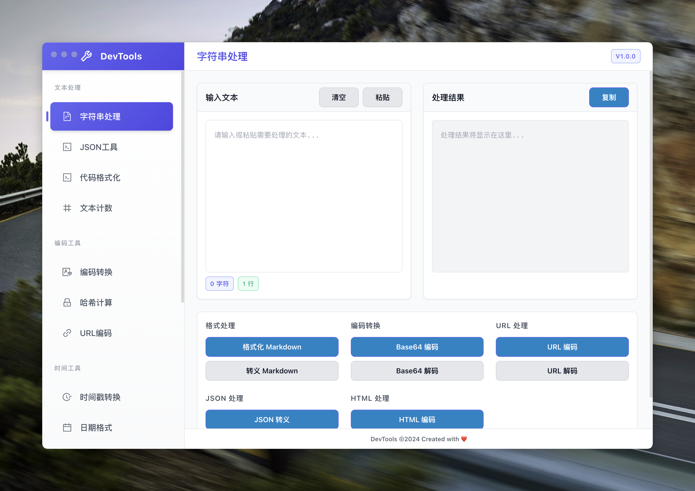

# 开发者工具

一个基于 Electron + Vue 3 的跨平台开发者工具集合，提供各种常用的开发工具功能。

## 预览



## 功能特性

- 🔐 **密码生成器** - 生成安全的随机密码
- 🔗 **URL编解码** - URL编码和解码工具
- 📅 **时间戳转换** - Unix时间戳与日期时间互转
- 🎨 **JSON工具** - JSON格式化、压缩、验证
- 🔤 **字符串处理** - 各种字符串转换和处理
- 📊 **文本计数器** - 统计文本字符、单词、行数
- 🖼️ **图片Base64** - 图片与Base64互转
- 🔒 **哈希工具** - MD5、SHA1、SHA256等哈希计算
- 📝 **编码工具** - Base64、HTML实体等编码转换
- 💰 **汇率转换** - 实时汇率查询和转换
- ⏰ **Cron表达式** - Cron表达式生成和解析
- 📅 **日期格式化** - 日期时间格式转换
- 🎨 **代码美化** - 支持多种语言的代码格式化
- 🗄️ **SQL格式化** - SQL语句格式化和压缩工具
- 📱 **二维码生成** - 文本转二维码
- ⏱️ **Quartz表达式** - Quartz Cron表达式工具

## 技术栈

- **前端框架**: Vue 3 + TypeScript
- **UI组件库**: Ant Design Vue
- **样式框架**: Tailwind CSS
- **桌面框架**: Electron
- **构建工具**: Vite
- **包管理器**: pnpm

## 开发环境要求

- Node.js 16+
- pnpm

## 安装和运行

### 克隆项目
```bash
git clone https://github.com/lifedever/dev-tools-app.git
cd dev-tools-app
```

### 安装依赖
```bash
pnpm install
```

### 开发模式运行
```bash
pnpm dev
```

### 构建应用
```bash
pnpm build
```

## 项目结构

```
dev-tools-app/
├── src/
│   ├── components/          # 组件
│   ├── views/              # 页面视图
│   ├── router/             # 路由配置
│   ├── stores/             # 状态管理
│   ├── styles/             # 样式文件
│   └── main/               # Electron主进程
├── build/                  # 构建资源
├── assets/                 # 静态资源
└── dist/                   # 构建输出
```

## 支持平台

- ✅ macOS (Intel & Apple Silicon)
- ✅ Windows
- ✅ Linux

## 许可证

MIT License

## 贡献

欢迎提交 Issue 和 Pull Request！

## 联系

如有问题或建议，请通过 GitHub Issues 联系。